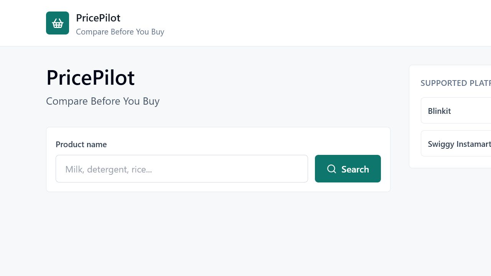
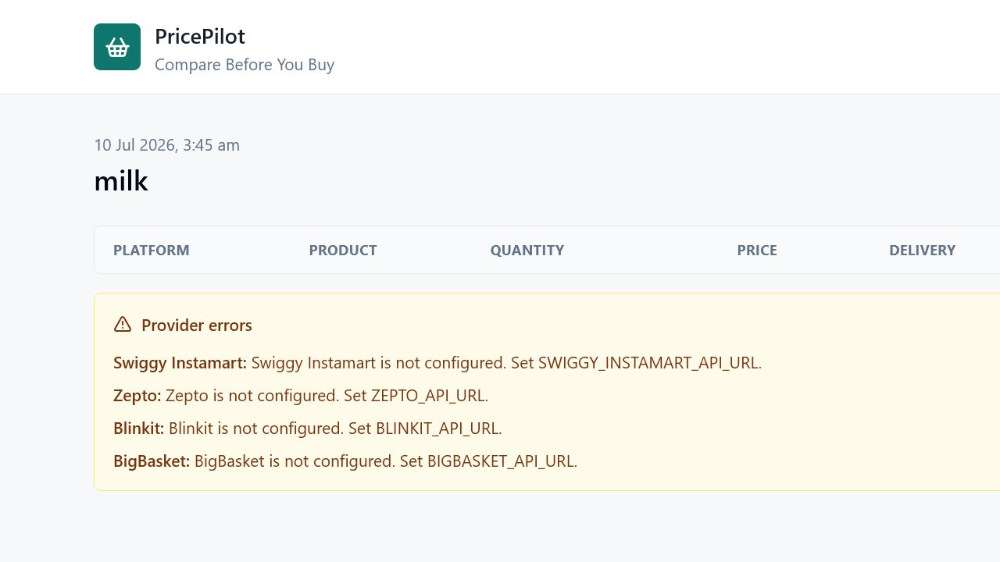

# PricePilot - Compare Before You Buy

PricePilot is a full-stack grocery and household price comparison app. Users search for a product, the Django API queries configured platform providers, stores the search, ranks offers, and the React frontend shows the cheapest total payable amount.

## Tech Stack

- Frontend: React, TypeScript, Vite, Tailwind CSS
- Backend: Django, Django REST Framework
- Database: PostgreSQL
- HTTP client: httpx
- ORM: Django ORM

## Project Structure

```text
pricepilot/
  backend/
    api/                 # DRF models, serializers, views, routes
    comparison/          # normalization and ranking service
    config/              # Django settings and URL config
    database/            # schema reference
    providers/           # Blinkit, Zepto, Instamart, BigBasket adapters
    manage.py
  frontend/
    src/
      components/
      pages/
      services/
      types/
  docs/
```

## Backend Setup

Create a PostgreSQL database:

```bash
createdb pricepilot
```

Create and activate a Python environment from `backend/`:

```bash
python -m venv .venv
.venv\Scripts\activate
pip install -r requirements.txt
copy .env.example .env
python manage.py migrate
python manage.py runserver
```

Set `DATABASE_URL` in `backend/.env` if your PostgreSQL username, password, host, or database name differs.

## Frontend Setup

From `frontend/`:

```bash
npm install
copy .env.example .env
npm run dev
```

The Vite dev server runs at `http://127.0.0.1:5173` and proxies API calls to Django at `http://127.0.0.1:8000`.

## Provider Configuration

PricePilot does not hardcode prices. Each provider calls a configured legal JSON endpoint:

```env
BLINKIT_API_URL=
BLINKIT_API_TOKEN=
ZEPTO_API_URL=
ZEPTO_API_TOKEN=
SWIGGY_INSTAMART_API_URL=
SWIGGY_INSTAMART_API_TOKEN=
BIGBASKET_API_URL=
BIGBASKET_API_TOKEN=
```

Endpoints should accept `q=<product>` and optionally `location=<value>`. Responses may be a list or an object with `results`, `products`, `items`, or `data`. Each item should include a product name and price using common keys such as `name`, `product_name`, `price`, `selling_price`, `delivery_charge`, `total_price`, `quantity`, and `product_url`.

If a provider is unconfigured or fails, the app logs the error, stores a failed comparison row, and continues with the remaining providers.

## API Documentation

### `POST /search`

Request:

```json
{
  "query": "milk"
}
```

Response: created comparison with ranked results, cheapest platform, and savings.

### `GET /history`

Returns saved searches with timestamps and cheapest summary.

### `GET /comparison/{id}`

Returns a single search and all comparison results.

### `DELETE /history/{id}`

Deletes a search and its comparison rows.

## Comparison Algorithm

The backend normalizes product names, merges all provider offers, and sorts successful results by:

1. Lowest total price
2. Lowest delivery charge
3. Lowest product price

It marks the cheapest result and calculates savings as `highest_total_price - cheapest_total_price`.

## Database Schema

Tables are implemented through Django migrations and mirrored in `backend/database/schema.sql`:

- `api_platform`
- `api_product`
- `api_searchhistory`
- `api_comparisonresult`

## Screenshots

Home:



Search results with unconfigured providers failing gracefully:



## Production Notes

- Replace `DJANGO_SECRET_KEY`.
- Set `DJANGO_DEBUG=False`.
- Set `DJANGO_ALLOWED_HOSTS`, `CORS_ALLOWED_ORIGINS`, and `CSRF_TRUSTED_ORIGINS`.
- Use a managed PostgreSQL instance and a process manager such as Gunicorn behind Nginx.
- Configure only official, partner, licensed, or otherwise legally accessible platform sources.
